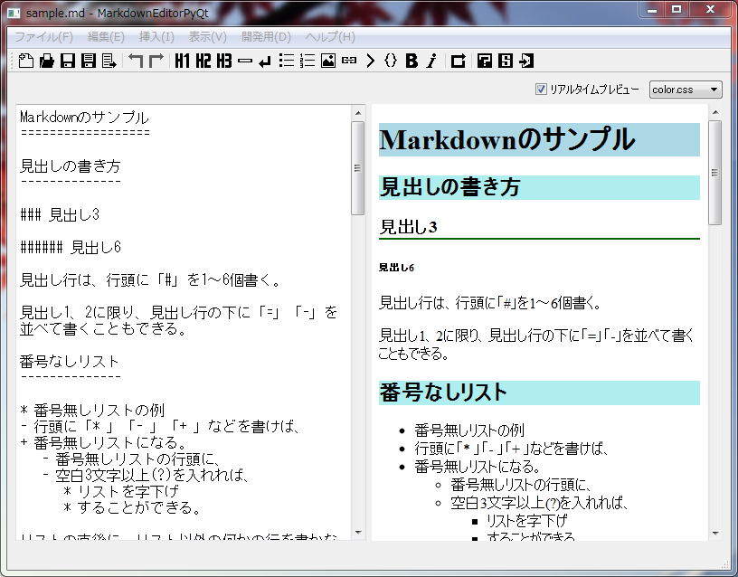

# MarkdownEditorPyQt

Python + PyQt4 + markdown2 で作った、Windows上で動作する、markdown記述用の簡易エディタです。

* Windows 7 x64、Windows XP Home SP3で動作確認済み。
* PyQtはクロスプラットフォームのはずですので、Mac や Linux で動作させることも、容易なのかもしれません。

## 特徴

### 長所

* Windowsで使えます。
* 日本語のインライン入力ができます。
* markdownからHTMLへの変換結果を、リアルタイムにプレビューできます。
* markdown用の記号がいくつか挿入できます。
* cssを切替えて、プレビューの見た目を変えられます。
* 変換結果をhtmlとしてエクスポートできます。
* 元はPythonスクリプトなので、動作を自分好みに修正することが容易です。

### 短所

* utf8n で書かれたファイルの読み書きにしか対応していません。

## スクリーンショット

<!--  -->

## 動作に必要なもの

### exe版を利用する場合

特に必要ありません。

### pyw版を利用する場合

* [Python](http://www.python.org/download/)
* [PyQt4](http://www.riverbankcomputing.co.uk/software/pyqt/download)
* [markdown2](https://github.com/trentm/python-markdown2)

## 実行

### exe版を利用する場合

distフォルダ内の markdowneditorpyqt.exe を実行してください。

### pyw版を利用する場合

Python +  PyQt4 + markdown2 がインストールされている環境で、markdowneditorpyqt.pyw を実行します。

## ライセンス

GPLです。

そもそもPyQtがGPLですので、PyQtを使ったプログラムは、GPLを継承しなければならないそうです。

改変や、exe化をして配布・公開する場合は、そのスクリプトソースも一緒に同梱すれば問題無いのでは…と思います。(誰でもソースを見れて、誰でも改変OKにすることが、GPLの目的のはずなので、ソースも同梱しておけば文句ないはず…。)

## 挿入機能について

* テキスト選択をしていない状態で挿入機能を呼べば、行頭や行末に記号を挿入したり、書き方の一例を挿入したりします。

* テキスト選択してから挿入機能を呼ぶと、複数行に対して同じ記号を挿入したり、選択した単語を装飾用記号で挟むこともできます。
   * 行単位で処理したい場合は、基本的に行単位で選択してから呼んでください。

## カスタマイズについて

### css

css\ 以下に、自分好みの .css ファイルを置けば、選べるようになります。

### htmlエクスポート

resource\templete.html を修正すれば、エクスポートするhtml内の記述を自分好みに変更できます。

### markdown用の記号

resource\templete_markdown.csv を修正すれば、自分好みの markdown用記号を使えます。

### exe化について

py2exe、PythonWin(pywin32？)等がインストール済みの環境なら、py2exe を使ってexe化できます。その場合、setup.py の、

        WIN32UI_DIR = r"C:\Python27\Lib\site-packages\pythonwin"
        IMAGELIB_DIR = r"C:\Python27\Lib\site-packages\PyQt4\plugins\imageformats"

の2行を自分の環境に合わせて修正した上で、make_exe.bat を実行してください。distフォルダ以下に markdowneditorpyqt.exe その他が生成されます。

以下の環境で、生成した .exe が動作することを確認しました。

* Windows7 x64
* Windows7 x64 上のXPモード
* Windows XP Home SP3

### GUIレイアウトを変更したい場合

Qt Designer で mywebview.ui を開いて変更・保存後、cv_webview.bat を実行して、.ui ファイルと、.qrcファイルをPythonスクリプトに変換します。

* pyw版を利用している場合は、markdowneditorpyqt.pyw を実行すれば変更内容が反映されます。
* exe版を利用している場合は、py2exe を使って exeファイルを作り直す必要があります。

cv_webview.bat の内容は以下の通りです。

    pyrcc4 -o resources_rc.py resources.qrc
    pyuic4 -o mywebview.py mywebview.ui

## 起動時のエラー等について

* 終了時のウインドウサイズその他を、settings.json に記録して、次回の起動時に復元しています。起動時にエラーが出る場合は、settings.json を削除してから起動を試みてください。

## 動作確認環境

* Windows7 x64
* Windows XP Home SP3
* Python 2.7.3 (python-2.7.3.msi)
* PyQt 4.9.4-1 (PyQt-Py2.7-x86-gpl-4.9.4-1.exe)
* markdown2 2.1.0

## 履歴

2012/10/05 ver. 0.0.7

* 環境によってはhelpが表示できなかったバグを修正。

2012/10/03 ver. 0.0.6

* ウインドウ表示位置、サイズ、フォントを設定ファイルに記録・復元できるようにした。

2012/10/02 ver. 0.0.5

* exe化したファイル、及びメインウインドウに、アイコンを追加。

2012/10/02 ver. 0.0.4

* exe化できるように修正。
* py2exe用のsetup.py等を追加。

2012/10/01 ver. 0.0.3

* ドラッグアンドドロップでファイルを開けるようにした。
* 日本語フォルダ・ファイル名も開けるように修正。

2012/09/30 ver. 0.0.2

* htmlプレビューをカーソル位置と(大味に)合わせてスクロールさせるようにした。

2012/09/29 ver. 0.0.1

* 編集機能を実装。

